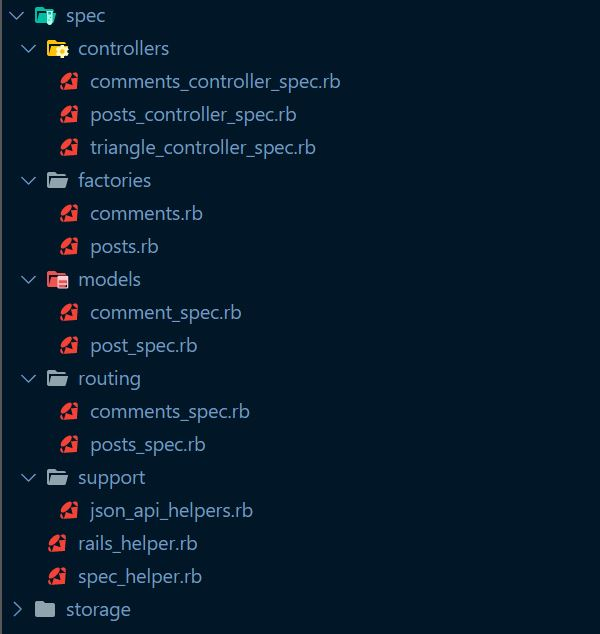
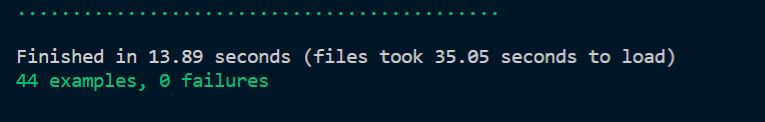
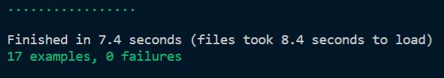
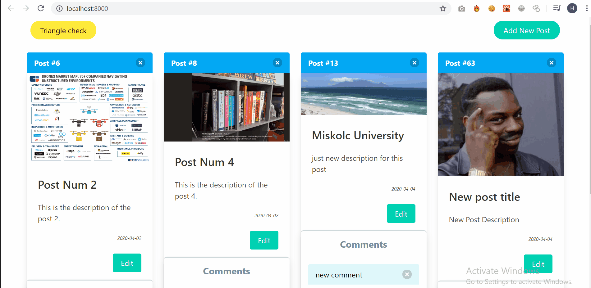
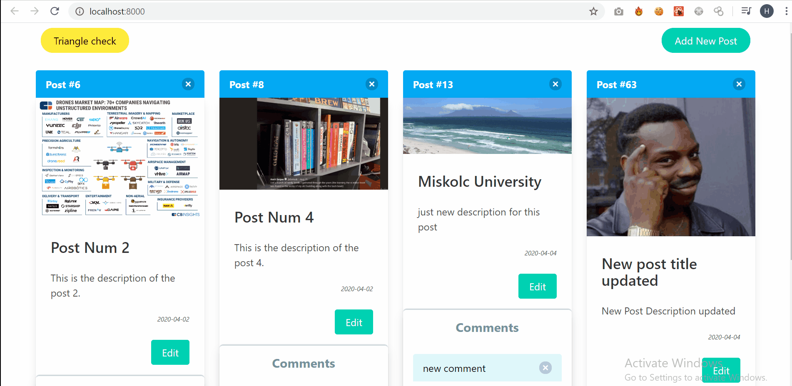

# React-Rails-App-MySQL-RSpec-Docker [](https://circleci.com/gh/Auto-Rooter/React-App-with-Ruby-On-Rails-and-Docker/tree/master)
<br>

## Technologies are used :
  - Front-end : React Framework
  - Back-end : Ruby on Rails
  - Testing : RSpec Framework
  - Database : Mysql
  - CI/CD : CircleCI
  - Images-Upload : Active Storage (on Backend) and react-dropzone-component (on React)
  - (React App connect to Rails API using axios)
  - React Style : bulma

<br><br>

## Usage(With Docker):
<br>
- Before we start , you should install Docker on your machine (For Back-end side):
<br><br>

```shell
$ git clone https://github.com/Auto-Rooter/React-App-with-Ruby-On-Rails-and-Docker.git && cd React-App-with-Ruby-On-Rails-and-Docker

# Setup
$ docker-compose build
$ docker-compose run web rake db:seed

# Run All Tests with RSpec
$ docker-compose run web RSpec

# Start
$ docker-compose up 
$ open http://localhost:3000


```
<br>
- Now we need to start the Front-end part (You need to install Node.js [Tested on v12.13.0 ] ):
<br><br>

```shell
$ cd project_frontend

$ npm install

# Start
$ npm start
$ open http://localhost:8000

```
<br><br><br>

## Usage(Without Docker):
<br>
- Before we start , you should install Ruby Installer  (For Windows).<br>
- Inside [\config\database.yml] file Comment Docker, CircleCi parts and make sure Normal part is Uncommented.
<br><br>

```shell
$ git clone https://github.com/Auto-Rooter/React-App-with-Ruby-On-Rails-and-Docker.git && cd React-App-with-Ruby-On-Rails-and-Docker


$ cd project_backend
# Install all Gems
$ bundle installr

# Create DB, Migrate, Seed(Not necessarily) 
$ rake db:create
$ rake db:migrate
$ rake db:seed


# Start
$ rails s
$ open http://localhost:3000

```
<br>
- Now we need to start the Front-end part (You need to install Node.js [Tested on v12.13.0 ] ):
<br><br>

```shell
$ cd project_frontend

$ npm install

# Start
$ npm start
$ open http://localhost:8000

```
## Tests:
<br>
- all the tests are under the directory [project_backend\spec] :
<br><br>



<br>
- You can Run all the test by:
<br>

```shell
# You should be in the backend directory
$ cd project_backend

# Run All the Tests
$ rspec

```
<br>
- You Should See Something like this:
<br><br>



<br><br>
- Also you can Run a specific Test (Ex: Run the test for POSTS Controller) :
<br>

```shell
# You should be in the backend directory
$ cd project_backend

# Run All the Tests
$ rspec spec/controllers/posts_controller_spec.rb

```
<br>




## REST APIs:
   **- Blog REST API (CRUD) : you can add post with(out) images also with comments**:<br>
    <br>
    - Create new post:<br>
    <br>
        
    <br>
    <br>
    <br>
    <br>
    - Update post:<br>
    <br>
        
    <br>
    <br>
    <br>
    <br>
    - Delete post:<br>
    <br>
        
    <br>
    <br>
    <br>
    <br>
    - Add and Delete comments:<br><br>
        
    <br>
    <br>
    <br>
    <br>
    <br>
    <br>
  **- Triangel Checker: check if a triangle (by entering three parameters a,b,c) Scaleme/Equilateral/Isosceles/Incorrect**:<br>
  <br>
        
    <br>
    <br>